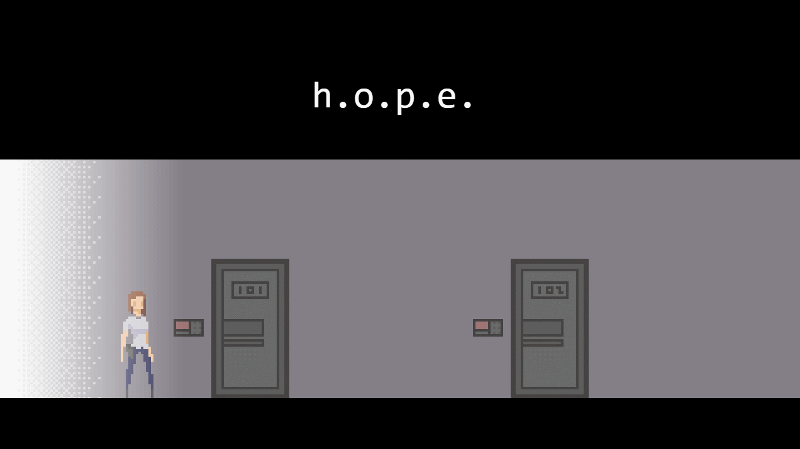
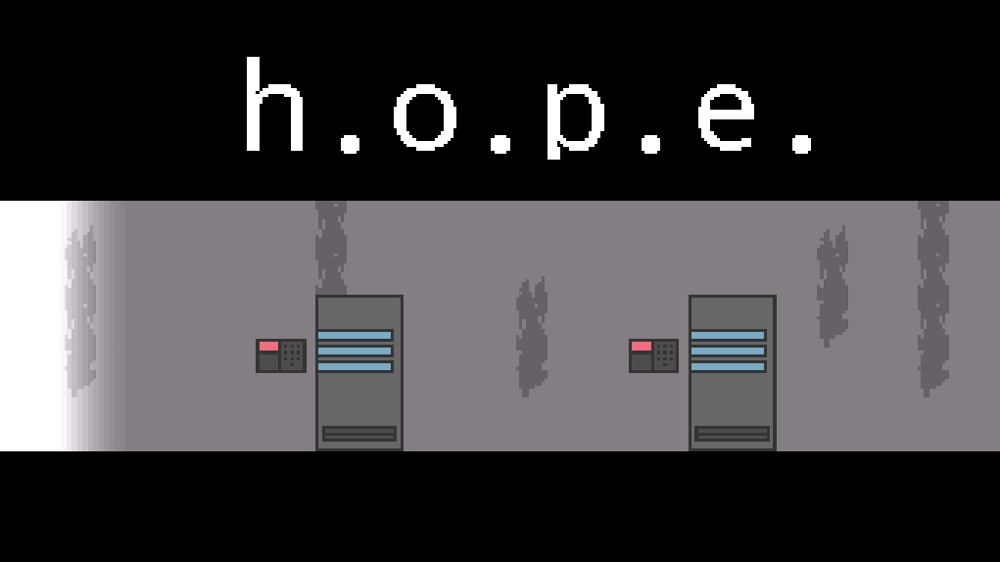
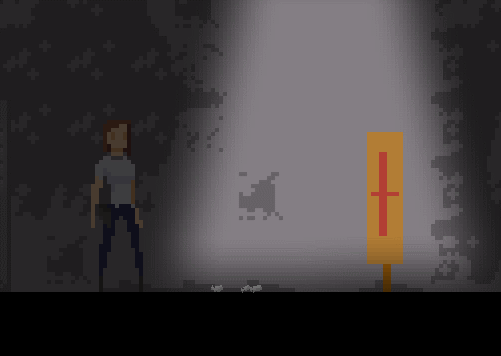
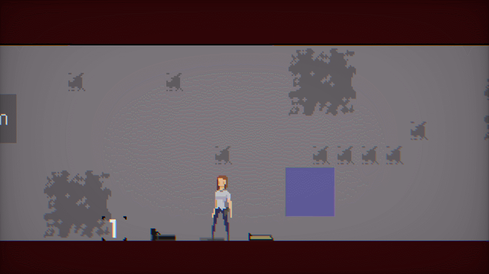
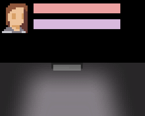
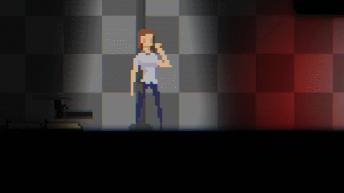
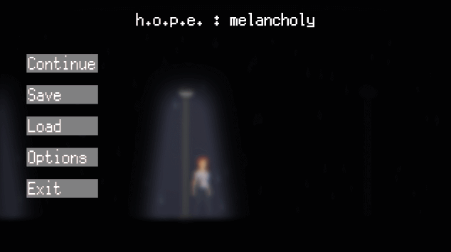

# Hope: Melancholy

This work is licensed under a <a rel="license" href="http://creativecommons.org/licenses/by-nc-nd/4.0/">Creative Commons Attribution-NonCommercial-NoDerivatives 4.0 International License (CC-BY-NC-ND)</a>.
________________

**Engine - Game Maker: Studio 2**

**Language - Game Maker Language**

**Source Code - Available: Latest version**

**Executables - Multiple versions up to latest**

**Development Date - 2020 to 2021**

________________

## Description
Will not be much of it here because I want to return to it later.

Initial version of h.o.p.e.

## Screenshots
Custom js game engine version (first)

 

GM:S2 version initial

First combat mechanics

 

Development tests

  

 

Dynamic locale strings

Final version features

 

